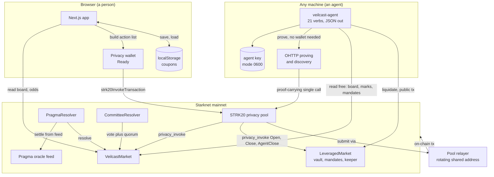
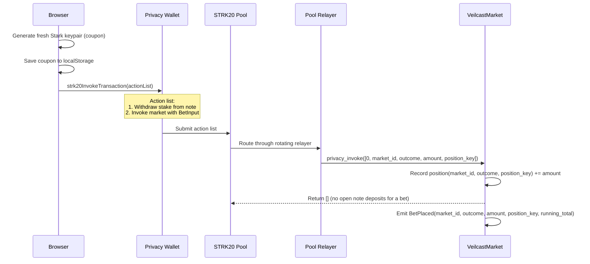
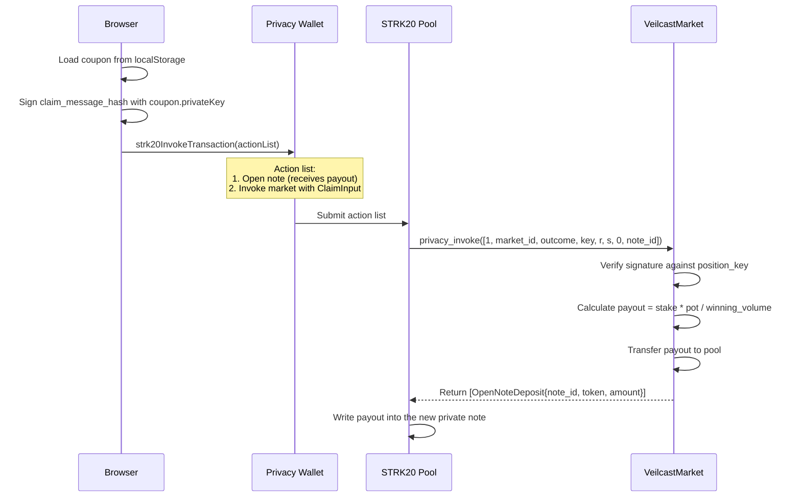
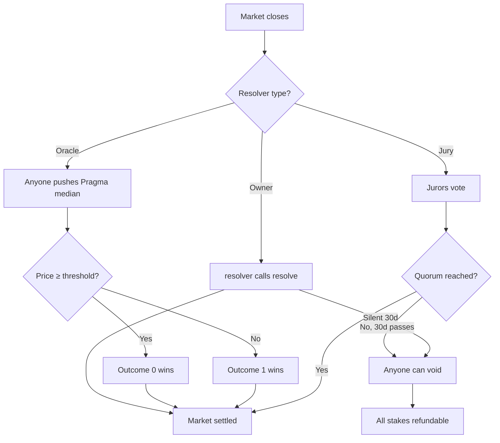
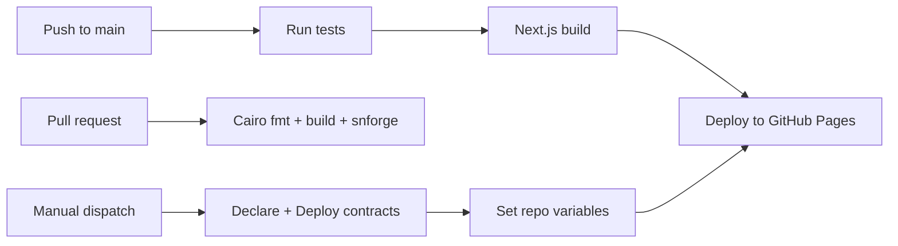

# Architecture

This document describes how Veilcast works at the system level: the contracts, the privacy
boundaries, the data flow from bet to claim, and how the pieces connect. Read the
[README](README.md) first for what and why; this is the how.

---

## System overview

Two clients drive the same contracts. A browser proves inside a privacy wallet. An agent proves for
itself over OHTTP, which is what lets it run with no human present.



Note what the agent never touches. It holds its own signing key and never an owner's coupon. It
reaches the pool through the same `privacy_invoke` entry point the browser does, so it gains no
privileged path. The only asymmetry is who does the proving.

---

## Privacy boundary

The single most important thing to understand is where the privacy line sits:

```
┌─────────────────────────────────────────────────────────────────────┐
│  PUBLIC (visible to everyone on-chain)                              │
│                                                                     │
│  • Deposits into the pool (address, token, amount)                  │
│  • Each bet's amount and the outcome it backs                       │
│  • Per-outcome volume (the odds)                                    │
│  • Market questions, resolvers, settlements                         │
│  • The on-chain sender of every private tx (a shared relayer)       │
├─────────────────────────────────────────────────────────────────────┤
│  PRIVATE (known only to the bettor's browser)                       │
│                                                                     │
│  • WHO placed a bet (the market never receives an address)          │
│  • The link between two bets by one person                          │
│  • The link between a winning position and the collecting wallet    │
│  • Note-to-note transfers inside the pool                           │
│  • The coupon private key (position ownership proof)                │
└─────────────────────────────────────────────────────────────────────┘
```

The privacy comes from the STRK20 pool sitting between the user and the market. Every bet and claim
is a pool action submitted by the pool's rotating relayer, so the user's address never touches the
market contract.

---

## Contract architecture

### VeilcastMarket (`cairo/src/market.cairo`)

The core contract. Holds all markets, their volumes, and their positions. Bound to one pool and one
token at construction (immutable).

```
Constructor: (pool: ContractAddress, token: ContractAddress)

Storage:
  next_market_id   : u64
  markets          : Map<u64, Market>
  questions        : Map<u64, ByteArray>
  outcome_labels   : Map<(u64, u8), ByteArray>
  outcome_volumes  : Map<(u64, u8), u128>
  positions        : Map<(u64, u8, felt252), u128>   // (market_id, outcome, position_key) → stake
  claimed          : Map<(u64, u8, felt252), bool>

Key functions:
  create_market(...)           → u64        // anyone can open a market
  privacy_invoke(calldata)     → OpenNoteDeposit[]   // only callable by the pool
  resolve(market_id, outcome)                // resolver only, after close
  void(market_id)                            // resolver only, or anyone after 30d
  collect_fee(market_id)                     // permissionless, pays the opener's fee
  get_market_views(start, count) → MarketView[]     // the board in one call
```

### PragmaResolver (`cairo/src/pragma_resolver.cairo`)

A resolver contract for price markets. No admin, no owner. Anyone can trigger settlement by
pushing the oracle's median into the contract once the market has closed.

```
Constructor: (market: ContractAddress, oracle: ContractAddress, max_price_age: u64)

Storage:
  market_thresholds : Map<u64, u128>   // market_id → price threshold
  market_pairs      : Map<u64, felt252> // market_id → Pragma pair id

Key functions:
  open_price_market(pair, threshold, ...)  → u64    // creates a market bound to a feed
  settle(market_id)                                  // pushes median, resolves if at/above
```

### CommitteeResolver (`cairo/src/committee_resolver.cairo`)

A resolver for questions no feed can answer. A fixed panel of jurors votes, and the first
choice to reach quorum settles the market.

```
Constructor: (market: ContractAddress)

Storage:
  committees : Map<u64, Committee>   // market_id → {jurors, quorum, votes}

Key functions:
  open_committee_market(jurors, quorum, ...)  → u64  // creates a jury-settled market
  vote(market_id, outcome_or_void)                   // juror only, one vote each
```

### LeveragedMarket (`cairo/src/leveraged_market.cairo`)

The leveraged companion. A position is long one side of a binary FPMM book; the vault lends against
the trader's margin to reach the notional; a keeper liquidates it if it goes underwater. The
pricing engine is `pricing.cairo`: exact integer arithmetic, no fixed-point exp or ln, every
rounding step in the pool's favor.

```
Constructor: (pool: ContractAddress, token: ContractAddress)

Storage:
  vault_capital, vault_free        : u128         // LP net worth and the free slice it can lend
  vault_shares, vault_shares_total : Map/u128     // LP share accounting
  total_backing, insurance         : u128         // complete-set backing plus the bad-debt fund
  markets   : Map<u64, LevMarket>                 // FPMM reserves + settlement metadata
  positions : Map<(u64, u8, felt252), Position>   // (market, side, key) → margin, borrow, shares
  mandates  : Map<(u64, u8, felt252), Mandate>    // the bounded agent authority, write-once at open

Key functions:
  add_liquidity / remove_liquidity                     // LPs fund the vault, priced in shares
  create_market(resolver, close_at, liquidity)         // seed a 50/50 book from the vault
  privacy_invoke(Open | Close | AgentClose)            // pool-only: the three private paths
  liquidate(market, side, position_key)                // permissionless once health <= 8%
  resolve / void                                       // resolver settles or cancels
  position_equity(...) → (value, equity, health)       // mark a position to the live book
  get_mandate(market, side, position_key) → Mandate    // read what authority a position carries
  quote_remove_liquidity(lp_shares) → (amount, payable)// what a withdrawal pays, plus whether it can
```

#### Pricing an LP share

`remove_liquidity` takes **shares**, not STRK. It pays `lp_shares * vault_capital / vault_shares_total`.
So a share cannot be valued without the ratio. An LP asked to type a share count into a box is being
asked to guess. `get_vault_capital` and `get_vault_shares_total` expose the two terms;
`quote_remove_liquidity` returns the payout the withdrawal will actually make, using the same `mul_div`
in the same order, so a quote cannot round differently from the thing it quotes.

The second return value matters as much as the first. Free collateral is what caps a withdrawal, and
seeding a market moves collateral out of it, so shares can be worth their full slice while the vault
cannot pay today. `payable: false` says exactly that rather than implying the stake shrank. Both clients
refuse a doomed withdrawal locally, so it costs no gas: the web app disables the button, and
`veilcast-agent vault-lp --lp <address>` reports `withdrawableNow` beside `worth`.

#### The Mandate: delegation without custody

A `Mandate` is the trust primitive the agent layer rests on. The owner attaches it inside `do_open`,
and that is the only moment it can be set: there is no setter, while re-opening the same key reverts with
`POSITION_EXISTS`. An authority that could be widened later would be no bound at all.

```
Mandate {
  agent_key       : felt252          // who may act. Zero means nobody ever can
  stop_price_bps  : u16              // fires at or below. Zero disables
  take_price_bps  : u16              // fires at or above. Zero disables
  payout_target   : ContractAddress  // where an agent close MUST pay
}
```

`do_agent_close` checks four things in order, then pays:

1. the position is open, else `NO_POSITION`
2. a mandate exists naming an agent, else `NO_MANDATE`
3. the signature verifies against the stored `agent_key` over the stored `payout_target`, else
   `BAD_CLOSE_SIGNATURE`
4. the live marginal price is at or below the stop, or at or above the take, else `MANDATE_NOT_MET`
5. the payout goes to `mandate.payout_target`, read from storage

The agent's whole input is six felts: `[2, market_id, side, position_key, r, s]`. There is nowhere in it
to put a recipient or a price, which is deliberate: **a field an agent could fill is a field an agent
could abuse.** The owner path verifies against `position_key` and the agent path against `agent_key`, so
neither signature is valid on the other's path and neither can be replayed as the other.

**Risk parameters:** 5x leverage cap, 8% maintenance margin, 1% keeper reward, 0.30% open fee to
insurance. **Solvency invariant:** `balance >= vault_free + total_backing + insurance` holds on
every path. The contract keeps a complete YES+NO set behind every share, so it cannot be drained;
the leverage risk is the vault's, bounded by liquidation and the insurance fund. Both are fuzzed.

---

## Data flow: placing a bet



**Key insight:** The market receives `position_key` (a fresh public key), never an address. The
relayer's address is on the transaction, not the bettor's. Two bets by one person use different
keys and cannot be linked on-chain.

---

## Data flow: claiming a payout



**Key insight:** The payout lands in a fresh private note. The user can later unshield to any
address, breaking the link between the bet and the withdrawal.

---

## Coupon system

The coupon IS the position. There is no on-chain account, no registry, no lookup by address.

```
┌─────────────────────────────────────────┐
│  Coupon (stored in browser localStorage) │
├─────────────────────────────────────────┤
│  marketId      : number                  │
│  outcome       : number                  │
│  privateKey    : string (Stark key)      │
│  positionKey   : string (public half)    │
│  amount        : string (wei)            │
│  createdAt     : timestamp               │
│  betTx?        : string                  │
│  claimedTx?    : string                  │
└─────────────────────────────────────────┘
```

**Backup formats:**
- Plain JSON (array of coupons)
- AES-GCM encrypted (PBKDF2-stretched passphrase, WebCrypto, browser-only)
- Bearer ticket (`veilcast:<base64>` URI + QR code, optionally passphrase-locked)

**Why this design:**
1. No on-chain identity means no address to trace
2. Fresh key per bet means no linkability between bets
3. The claim signature covers the payout target, preventing relayer redirection
4. Bearer transfer enables secondary markets for positions

---

## Parimutuel math

Veilcast uses parimutuel (pool) betting, not a counterparty model:

```
payout = stake × pot / winning_volume
```

All stakes go into one pot. When the market resolves, the entire pot is split among the winning
side in proportion to their stakes. The fee (if any) is deducted from the gross pot first.

```typescript
// Net payout calculation (what the contract computes)
const grossPot = market.pot;
const fee = (grossPot * BigInt(market.fee_bps)) / 10000n;
const netPot = grossPot - fee;
const payout = (stake * netPot) / winningVolume;

// Quoted odds (what the app shows, including the user's own stake)
const impliedOdds = (volumeForOutcome + myStake) / (pot + myStake);
const quotedPayout = myStake * (pot + myStake) / (volumeForOutcome + myStake);
```

**Edge cases:**
- Resolved on an outcome nobody backed → void (all stakes refundable)
- Resolver goes silent → anyone can void after 30 days
- Fee is charged at settlement, never during betting

---

## Resolution paths



---

## Frontend architecture

```
src/app/
├── layout.tsx                    Root layout (providers, chrome)
├── page.tsx                      Home: board + positions tabs
├── market/page.tsx               /market/?id=N detail page
├── globals.css                   CSS custom properties (dark/light)
├── uni.module.css                Shared component styles
└── components/
    ├── Chrome.tsx                Nav, footer, theme toggle slot
    ├── ThemeToggle.tsx           Dark/light with localStorage persistence
    ├── Onboarding.tsx            First-run privacy explainer
    ├── Skeleton.tsx              Loading shimmer placeholders
    ├── Toast.tsx                 Global toast notification system
    └── client/
        ├── provider/             Wallet + RPC providers (Zustand)
        ├── strk20/               Shield, unshield, pool action submission
        ├── WalletHandle/         Connect/disconnect button
        ├── market/
            ├── MarketsPanel.tsx   Board grid with search/filter/sort
            ├── MarketCard.tsx     One market's card (odds bars, state)
            ├── MarketDetail.tsx   Full market page (chart, bet, positions)
            ├── BetForm.tsx        Amount input, outcome picker, quote
            ├── OddsChart.tsx      Historical odds from on-chain events
            ├── ActivityFeed.tsx   Event log (amounts, no addresses)
            ├── PositionsPanel.tsx All coupons, P&L, batch actions
            ├── PositionRow.tsx    One position with claim/backup
            ├── VaultTools.tsx     Backup/restore/transfer coupons
            ├── CouponShare.tsx    Bearer ticket generation + QR
            ├── CreateMarket.tsx   Market creation form
            ├── ResolverControls.tsx Resolve/void buttons (resolver only)
            ├── FeedSettle.tsx     Push Pragma median to settle
            ├── CommitteeVote.tsx  Jury voting interface
            ├── PortfolioSummary.tsx Totals, net P&L, CSV export
            └── QrCode.tsx         QR code renderer (qrcode-generator)
        └── leverage/
            └── LeveragePanel.tsx  Trade, positions and vault, in one panel
```

**State management:** Zustand stores for wallet connection, current network, and provider instance.
Coupons are stored in localStorage (never sent to a server). Board and market data are fetched
directly from the RPC via starknet.js multicall.

**Static export:** The app is built as `next export` — no server runtime. Every page is client-side
rendered from on-chain data. This means infinite scaling, no backend to trust, and
censorship-resistant hosting on GitHub Pages or IPFS.

---

## SDK design

`sdk/` is a standalone TypeScript package with three layers:

| Layer | Purpose | Example |
|-------|---------|---------|
| **Reads** | Fetch and decode on-chain state | `loadBoard()`, `loadLevBoard()`, `oddsSeries()` |
| **Actions** | Build STRK20 action lists for private operations | `betActions()`, `openActions()`, `closeToWalletActions()` |
| **Calls** | Build `Call` objects for public operations | `createMarketCall()`, `resolveCall()`, `addLiquidityCall()` |

The SDK depends only on `starknet` (peer, v10). It ships the contract ABIs, so consumers need
no extra packages. The payout and FPMM math, the claim hash and the close hash are all tested against
shared vectors with the Cairo contract and the app, so all three implementations agree.

---

## Test strategy

| Layer | Framework | Count | What's covered |
|-------|-----------|-------|---------------|
| Cairo contracts | snForge 0.63 | 69 | Full bet, resolve and claim path, access control, fee math, both resolvers, the leveraged market's open, close and liquidate lifecycle, plus 12 fuzz tests over the FPMM, the solvency invariant and the agent trust boundary, then LP share pricing against what a withdrawal actually pays |
| TypeScript | Vitest 4.1 | 145 | Calldata encoding, claim and close signatures, parimutuel and FPMM math, leverage quotes and position marks, mandate validation, coupon vault (AES-GCM), board reads, event parsing, portfolio P&L, LP share pricing, SDK |
| Agent runtime | node:test | 77 | The pricing port against Cairo vectors, calldata layouts, the raw-felt board decoder against literal mainnet felts, the custody guard, the program's eligibility rule, LP share pricing and P&L folding, host detection and every generated skill file's shape |

**Pinned vectors.** The claim and close message hashes are computed in four independent
implementations (Cairo, the SDK, the app, the agent runtime) and asserted against the same hardcoded
felt in every suite. A drift in any one of them fails a test before a transaction can revert.

**Adversarial fuzz over the trust boundary.** The security claim behind the Mandate is not asserted
once, it is hammered: random stranger keys never close a mandated position, the legitimate agent is
refused at random prices outside its band, the pinned target is always paid and no other address ever
receives anything, owner and agent signatures never verify on each other's path, plus solvency holds
across random interleavings of agent close and keeper liquidation.

---

## CI/CD pipeline



Three workflows:
1. **`pages.yml`** — on every push to main: test, typecheck, build, deploy to Pages
2. **`contracts.yml`** — on Cairo changes: format check, build, snforge test
3. **`deploy-contracts.yml`** — manual dispatch: declare + deploy to Sepolia or Mainnet

---

## Security considerations

| Concern | Mitigation |
|---------|-----------|
| Coupon loss = payout loss | Backup/export in Positions tab, encrypted option |
| Coupon theft = payout theft | AES-GCM encryption, passphrase-locked bearer tickets |
| Relayer redirection | Claim signature covers payout target (address or note) |
| Front-running bets | Bets are pool actions — only the relayer sees them, and it has no reason to front-run a parimutuel market (no counterparty to exploit) |
| Stale oracle settling wrong | `max_price_age` constructor arg rejects old medians |
| Resolver going silent | 30-day public void fallback, permissionless |
| Fee traps | Fee is fixed at market creation, capped at 5%, shown on the board |
| localStorage XSS | CSP headers, no inline scripts, no server-side data |

---

## Design decisions and tradeoffs

| Decision | Why |
|----------|-----|
| Parimutuel over orderbook | No counterparty matching needed, works with any liquidity level, simple on-chain math |
| Fresh key per bet | Unlinkability at the cost of per-bet key management (mitigated by batch backup) |
| Static export over SSR | No server to trust, deploy anywhere, censorship-resistant |
| Wallet API over raw signing | The wallet handles proving and private state — the app never sees a viewing key |
| Amounts public | A market with hidden sizes cannot produce accurate odds — the product would be broken |
| On-chain event history | No indexer needed, no off-chain infra to run, chart data is verifiable |
| Board in one call | `get_market_views(start, count)` saves 4N RPC calls on page load |

---

## Future work

- **Sub-account positions:** When STRK20 sub-accounts ship, positions could be held as sub-account state instead of browser localStorage
- **Cross-chain bets:** Bridge integration to accept bets from EVM/Solana wallets via the privacy pool
- **AMM for the parimutuel board:** the leveraged market already runs a seeded FPMM; bringing that liquidity model to the main board would bootstrap thin markets
- **Resolution DAOs:** Decentralized resolution infrastructure for arbitrary questions
- **Mobile app:** React Native with secure coupon storage in the device keychain
