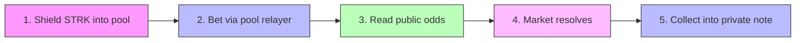

<p align="center">
  
</p>

<h1 align="center">Veilcast</h1>

<p align="center">
  <strong>Private prediction markets on Starknet.</strong><br />
  <em>Visible odds, invisible bettors, plus an agent that can trade for you without being able to take your money.</em>
</p>

<p align="center">
  <a href="https://zkasuran.github.io/veilcast/"></a>
  <a href="https://github.com/zkasuran/veilcast/actions/workflows/contracts.yml"></a>
  <a href="https://github.com/zkasuran/veilcast/actions/workflows/pages.yml"></a>
  
  
  <a href="https://www.npmjs.com/package/veilcast-agent"></a>
  <a href="https://www.npmjs.com/package/veilcast-sdk"></a>
  <a href="LICENSE"></a>
</p>

<p align="center">
  <a href="https://zkasuran.github.io/veilcast/"><b>Live demo</b></a>
  · <a href="#the-building-journey">Building journey</a>
  · <a href="docs/INTEGRATION.md">Integration</a>
  · <a href="docs/SECURITY.md">Security</a>
  · <a href="docs/OPERATIONS.md">Operations</a>
  · <a href="ARCHITECTURE.md">Architecture</a>
  · <a href="sdk/">SDK</a>
</p>

<p align="center">
  <sub>
    Try it without installing anything:<br />
    <code>npx veilcast-agent markets</code> reads the live mainnet board. No keys, no wallet, no setup.
  </sub>
</p>

---

## For judges

| | |
|---|---|
| **What** | A parimutuel prediction market where amounts are public (so the odds are honest) and identities are private (so the flow is honest) |
| **RFP match** | [RFP-07: prediction markets with visible odds and invisible bettors](https://strk20.starknet.io/rfp/private-prediction-market) |
| **Live on mainnet** | Market, Pragma resolver and committee resolver deployed. Four pool transactions recorded. Every claim re-derivable from chain |
| **Novel design** | Bearer coupons (the position *is* the key) · dual resolution (oracle plus juror committee) · a leveraged FPMM book with a keeper-liquidated vault · **on-chain mandates: an agent trades for you and structurally cannot take your money** |
| **Agent-drivable** | The only entry in the field an autonomous agent can drive on mainnet with no browser. Ships skills for Claude Code, openclaw and Hermes |
| **Verify us, do not trust us** | `node agent/cli.mjs verify` re-derives every recorded transaction and class hash straight from chain, then exits non-zero if one fails |
| **Tests** | **265 green.** 66 Cairo with zero warnings (12 of them fuzz), 141 TypeScript, 58 agent runtime |
| **Published** | [`veilcast-agent`](https://www.npmjs.com/package/veilcast-agent) and [`veilcast-sdk`](https://www.npmjs.com/package/veilcast-sdk) are on npm, so `npx veilcast-agent markets` works from a bare shell |
| **Stack** | Cairo 2.20 · Next.js 16 · TypeScript · a dependency-light Node agent runtime · STRK20 Wallet API · Pragma |

**The one-minute version.** A prediction market only means something if its price signal is honest, and
an honest signal needs open volume. It breaks when whales can be tracked. STRK20 gives exactly the split
that fixes it: amounts public, identities private. On top of that we built leverage that cannot drain the
contract, then a **mandate**: a bounded authority you hand an agent so it can fire your stop while you
sleep and can do nothing else. Not by convention. By the contract.

## What it is

Veilcast is a prediction market where the crowd's information stays public while the crowd stays
anonymous. Anyone can read the odds, the volume behind each outcome, and how a market is moving.
Nobody can see who placed a bet, tie two bets to one person, or tie a payout back to the bet that
earned it.

**Why this matters:** A prediction market is only worth reading when its price signal is honest,
and an honest signal needs open volume. It breaks when large players can be tracked — visible whales
cause herding and front-running, which drives off the flow that makes the price accurate. STRK20
lets Veilcast keep both halves: amounts stay public so the odds are real, identities stay private so
the flow stays honest.

---

## Privacy model

STRK20 gives identity privacy, not amount privacy. Veilcast is built around exactly that split.

| 🔓 Public | 🔒 Private |
|---|---|
| Each bet's amount and the outcome it backs | Who placed it — the market contract never sees an address |
| Per-outcome volume and the odds that come off it | The link between one person and their bets, across markets and inside one |
| Every market's question, resolver, and settlement | The link between a winning position and the wallet that collects it |
| A shield deposit: the depositor, the token, the amount | A payout, when it is collected into a private note |

> **We do not overclaim.** Shielding into the pool is a public, screened deposit. The privacy starts
> after that, once the balance is a private note. Amounts are public on purpose — a market with
> hidden sizes cannot produce accurate odds.

---

## How a bet works



1. **Shield** — Deposit STRK into the STRK20 pool. Public, screened on-chain. You now hold a private note.
2. **Bet** — One pool transaction atomically: withdraw your stake into the market contract and book the bet. The on-chain sender is the pool's rotating relayer — your address appears nowhere.
3. **Read the odds** — Per-outcome volume is public. The implied probability and payout multiple are the same for everyone.
4. **Resolve** — The market's named resolver settles it on-chain, in public.
5. **Collect** — Sign your coupon and the payout lands in a fresh private note inside the pool.

---

## The coupon system

Nothing on-chain ties a position to an account. When you bet, the browser generates a fresh Stark
keypair, sends the public half with the bet, and keeps the private half in localStorage.

**That is what makes the payout unlinkable:** the coupon key is fresh per bet, so two bets by the
same person share nothing on-chain, and the claim carries no address.

From the Positions tab you can:
- 🔐 **Back up** coupons (plain JSON or AES-GCM encrypted behind a passphrase)
- 📲 **Transfer** a position as a bearer ticket (`veilcast:` URI + QR code)
- 💰 **Batch collect** all winning positions in one pool transaction

---

## Resolution

Veilcast ships three resolution paths:

| Type | Contract | How it works |
|------|----------|-------------|
| **Owner** | `market.cairo` | Whoever opens a market is its resolver |
| **Oracle** | `pragma_resolver.cairo` | Bound to a Pragma spot pair and threshold — anyone can push the feed's median in to settle |
| **Jury** | `committee_resolver.cairo` | Named panel votes, first to quorum settles. Deadlock → 30-day public void |

Resolution is deliberately public. The terms of a market are not the thing that needs hiding. What
stays private is who was on each side.

---

## Leverage

Alongside the parimutuel board, Veilcast runs a leveraged market: isolated-margin directional
positions on a binary book, opened and closed with the same privacy as a bet.

- **Provable FPMM.** Each market is a constant-product book over YES and NO shares, priced in exact
  integer arithmetic. No fixed-point `exp` or `ln`, so the math is auditable and every rounding step
  favors the pool. The quote a trader sees in TypeScript is the number the contract books, pinned
  felt for felt against the Cairo tests.
- **Isolated margin, up to 5x.** A trader posts margin, the vault lends the rest up to the notional,
  and the position is marked and settled against the live AMM price. Margin is the most a trader can
  lose.
- **Keeper-liquidated, insurance-backed.** Anyone can liquidate a position once its equity falls to
  8% of notional, repaying the vault before the loan goes bad. An insurance fund, seeded by a 0.30%
  open fee, absorbs any residual gap.
- **Solvent by construction.** Reserves are backed one for one by STRK held in the contract (the
  complete-set model), so the contract itself can never be drained. Leverage risk lives in the
  vault, bounded by liquidation and insurance. The balance invariant `balance >= vault_free +
  total_backing + insurance` is asserted on every path and fuzzed across random open, close and
  liquidate sequences.
- **Private open and close.** Both route through the STRK20 pool exactly like a bet, keyed by a
  bearer coupon whose signature names the payout target so a relayer can never redirect it.
  Liquidity and liquidation are public, because they are the market's plumbing, not a trade.

Trade it from the **Leverage** tab: pick a side, post margin, choose leverage against a live quote,
then watch the position marked to the book and close to your wallet.

---

## Agents

Veilcast is drivable by an autonomous agent on mainnet, with no browser and no human in the loop.

Most STRK20 dapps cannot be, because a pool action carries a STARK proof and the mainnet proving
service URL was never published, so the field settled on a browser wallet with the prover baked in.
The proving and discovery services are reachable over OHTTP with no API key, so a process can prove
and submit on its own. `agent/` encodes that whole flow, along with every rule it took a failure to
learn. See [docs/INTEGRATION.md](docs/INTEGRATION.md).

```bash
npx veilcast-agent init      # detects your host, writes its skill files, generates a key, probes mainnet
veilcast-agent status        # what you are pointed at and what you may do
veilcast-agent markets       # the live mainnet board: questions, odds and what a stake pays
veilcast-agent flow --market 0   # that market's bet history, amounts and bearer keys, never addresses
```

Those two read the deployed mainnet market, so they work right now with no keys and no setup. The board
is decoded straight from raw felts, which means the runtime needs no ABI file and cannot drift from the
deployment. `markets` also quotes what a given stake would pay, counting itself into the pot the way the
contract does, so an agent can refuse a bet whose multiple is below 1.0.

It ships skills for **Claude Code, openclaw and Hermes**, plus a host-neutral `AGENTS.md` and a
machine-readable capability manifest, all generated from one source of truth so they cannot disagree.
Every command prints a single JSON object, every money command is a dry run unless you pass
`--confirm` and the exit codes are stable enough to branch on.

### Delegation without custody

The interesting part is what an agent is allowed to do. A **mandate** is a bounded authority the
position owner attaches at open: an agent key, a stop and take price band and a payout address. All
three are stored on-chain and checked on every agent close.

So an agent can fire your stop while you sleep. It cannot redirect the payout, cannot act outside the
band, cannot widen its own authority, cannot touch a self-managed position and cannot pass its
signature off as yours. None of that is policy in the CLI. It is
[cairo/src/leveraged_market.cairo](cairo/src/leveraged_market.cairo), which is why an agent key is
safe to hand out: the worst a stolen one buys is firing a stop the owner already asked for, at a price
the market actually reached, paying the owner's own address.

That claim is fuzzed rather than asserted. See [docs/SECURITY.md](docs/SECURITY.md) for the threat
model and the test that proves each line of it and [docs/OPERATIONS.md](docs/OPERATIONS.md) for
running a keeper or a watcher with measured costs.

---

## The building journey

Twenty days, six phases. Each one shipped something the next one needed. Each one also taught
something that changed the design. The commits are the record; this is the reasoning behind them.

```
Aug 14 ────── Aug 21 ────── Aug 26 ────── Aug 27 ────── Aug 28 ────── Sep 02
  │              │             │             │             │             │
 scaffold      product       mainnet      leverage       agent         mandate
 the market    the board     the money    the engine     runtime      and publish
```

The last two phases are one arc pulled apart by a hard constraint. The agent runtime went in on
Aug 27 and 28. The trust primitive it needed to be safe landed after it, because the runtime is what
made the question urgent: once a process can trade on its own, what stops it stealing? So the phases are
in the order the work actually happened, not the order that reads tidily.

---

### Phase 1 · The market, Aug 14 to 18

Started from the STRK20 starter kit and replaced its echo helper with a real parimutuel market in
Cairo. The first decision set everything after it: **a bet is keyed by a fresh public key, never by an
account.** The market contract is never told an address, so there is nothing to leak.

That single choice is what makes payouts unlinkable. It also forced a second one: if the position is a
bearer key, a claim signature must name where the money goes, else a relayer could point it anywhere.
So `claim_message_hash` binds the recipient into the signed message. A copied coupon can only ever pay
the same address.

Then the parts a market needs to be usable rather than a demo: on-chain history from its own events,
a capped and disclosed fee, plus two resolution paths beyond trusting the opener. A **Pragma resolver**
so a price question settles from a feed median with nobody to trust. A **committee resolver** so a
question no feed can answer settles by a juror vote, with a 30 day public void if the panel deadlocks.

### Phase 2 · The product, Aug 20 to 24

A coupon is cash, so it needed treating like cash: AES-GCM encrypted backups behind a passphrase,
bearer tickets as a `veilcast:` URI and QR so a position can move between devices, plus batch collect so
five wins are one pool transaction rather than five.

Published [`veilcast-sdk`](sdk/) so another team could build on this rather than fork it. Writing the
SDK is what surfaced the discipline that later saved the whole leverage layer: **the payout maths is
implemented twice, in Cairo and TypeScript, then pinned to one hardcoded felt in both suites.** A drift
in either fails a test instead of reverting a live transaction.

### Phase 3 · Mainnet, Aug 26

The day the theory met the gas meter.

Deployed the market and both resolvers to Starknet mainnet, seeded three markets, then started on the
pool transactions the program scores. Then the field's blocker hit us: a STRK20 pool action carries a
STARK proof, **and the mainnet proving service URL was never published.** Eight upstream issues sit on
exactly this. The accepted answer was that mainnet needs a human driving a browser wallet with the
prover baked in.

We went looking anyway. The services turned out to be reachable over OHTTP with no API key. That
unlocked headless mainnet, then cost us a rule per failure:

| The failure | The rule |
|---|---|
| `PRIVATE_KEY_NOT_CANONICAL` | the viewing key is `poseidon([pk]) mod (n/2)`, never zero |
| proof rejected | prove against `head - 15`, not the head |
| ProofFacts unparseable | submit is proof-carrying and **single-call**; a multicall breaks it |
| `Insufficient ERC20 allowance` | the pool allowance is a separate, earlier transaction |
| `NO_REPLAY_PROTECTION` | a fresh account's first deposit is atomic register plus setup plus deposit |
| `INDEX_NOT_SEQUENTIAL` | poll discovery between deposits; never sleep and hope |

Every one of those now lives once, in [`agent/src/pool.mjs`](agent/src/pool.mjs), so nobody has to
rediscover them. Three shields and a real private bet landed, with one honest finding alongside:
the **payout leg still reverts on mainnet** with a proof-version mismatch upstream of us. It is
documented in [OPERATIONS.md](docs/OPERATIONS.md) rather than hidden. It affects the whole program.

### Phase 4 · Leverage, Aug 26 to 27

Leverage on a privacy pool sounds like it should not work, because margin systems assume an account
and this one has none. It does work, because **margin health is a function of public data.** Size,
entry and mark price are already on chain. A liquidation needs to know *which* position is underwater,
never *who owns it*.

Two design calls worth naming. We chose an **FPMM over LMSR**: LMSR needs fixed-point `exp` and `ln`,
and a security claim you cannot audit is not a security claim, so exact integer arithmetic won and
every rounding step favours the pool. And solvency comes from **complete-set backing**: reserves are
backed one for one by STRK held in the contract, so the contract itself cannot be drained. Leverage is
a *vault* risk, bounded by keeper liquidation and an insurance fund. The invariant
`balance >= vault_free + total_backing + insurance` is asserted on every path.

Then we fuzzed it rather than asserting it: a buy never shrinks the constant product, a round trip
never prints money, the two sides always price a coin, plus solvency survives random open, close and
liquidate sequences.

### Phase 5 · The agent runtime, Aug 27 to 28

The headless unlock from Phase 3 made something possible that no rival in the field can build, so this
phase was about turning a pile of proven recipes into something another process can actually drive.

The shape mattered more than the feature list. An agent is not a human with a smaller screen, so the
interface is built for a parser rather than a reader: **one JSON object per invocation on stdout**,
progress on stderr, plus exit codes distinct enough to branch on without reading text. Code `2` means a
guard said no, which is not a malfunction and is worth retrying later. Code `3` means the setup is wrong
and `doctor` will name the fix.

Then the rule that shapes everything else: **every command that can spend is a dry run unless
`--confirm` is passed.** That is not caution for its own sake. The prover simulates server-side and
rejects a bad invocation before any gas is spent, so a dry run genuinely validates rather than merely
declining to act. An agent gets a free correctness check on every money operation, which is the
opposite of the usual tradeoff.

The pieces that made it a runtime rather than a script: the FPMM and the leverage maths ported to
JavaScript so an agent can quote and plan for free, keeper and mandate scans that enumerate positions
from the event log (the contract has no list, because positions are keyed by bearer coupons), and
`install.mjs`, which generates every host's skill pack from **one manifest** so a Claude Code skill, an
openclaw tool and a Hermes capability list cannot drift apart.

Also the module that took the longest to get right for the least glamour: the parimutuel board decoded
straight from raw felts. A `MarketView` embeds a `ByteArray`, so the fields after the question have no
fixed offset and the felt stream has to be walked. Doing it that way means the runtime carries no ABI
file and cannot drift from the deployment. Its test pins the **literal 27 felts mainnet returns**.

### Phase 6 · The mandate, then shipping it, Sep 2

The runtime is what made the real question urgent. Once a process can trade on its own, **what stops it
stealing?**

The answer is the **mandate**: a bounded authority the owner attaches at open, carrying an agent key, a
stop and take price band, plus a payout address. All three go to contract storage and are checked on
every agent close. The agent's calldata is six felts and contains no recipient and no price, because
*a field an agent could fill is a field an agent could abuse.*

So the worst a stolen agent key buys is doing what the owner already asked for, at a price the market
actually reached, paying the owner's own address. That is what makes an agent key safe to hand out, and
it is fuzzed across random stranger keys, random out-of-band prices, random sizes and both
signature-replay directions rather than asserted once.

Then the last step, easy to skip and it would have made the rest a lie: **both packages went to npm.**
The README's headline command was `npx veilcast-agent markets`, which was false while nothing was
published. A runtime a judge has to clone is a repository rather than an agent product. It now works
from a bare shell on a machine that has never seen this project. Trying to publish immediately
surfaced three defects that testing had not: a README listed in `files[]` that did not exist, a CLI that
was not executable so the `bin` entry would have failed on install, plus a module missing from the
package entry point so the documented example could not run.

---

### What the work caught

Building against a live chain finds things a test suite cannot. Four worth naming, because each one
would have shipped:

- **The keeper was blind.** Leverage events were not `#[key]`-annotated, so a keeper filtering the log
  by market found nothing and `keeper-scan` always returned zero. Seventeen annotations fixed it. No
  unit test could have caught it; only a real event log could.
- **The custody guard was backwards.** It refused any long hex string as "probably a private key",
  which rejected the position *public* keys four verbs are meant to take. The guess was unsound in both
  directions. It now derives the public half and asks the chain whether *that* owns a position, which
  only a private key's public half can.
- **A successful deploy would still have shown "not deployed".** The Pages build had no leverage
  address variable, so the live site could not have picked it up.
- **My own rival-audit script reported every competitor as having zero pool events.** A leading-zero
  mismatch. Caught by running it against our own known-good transaction as a control.

The deploy is now rehearsed end to end against a local devnet before a single real token moves, it
refuses to start underfunded, then a second script finishes the job afterwards without sending anything.

```bash
starknet-devnet --seed 0 --port 5055 &
cd cairo && node scripts/rehearse-devnet.mjs
#  declare · deploy · seed the vault · create a market · open with a mandate
#  a stranger key fires it        → refused
#  the real agent fires early     → refused, MANDATE_NOT_MET
#  price crosses the band, agent fires → paid the pinned address, still solvent
```

---

## Tech stack

| Layer | Technology |
|---|---|
| Contracts | Cairo 2.20 · Scarb · Starknet Foundry · **66 tests, 12 of them fuzz, zero warnings** |
| Agent runtime | Node 20, one dependency (starknet.js) · **58 tests** · 20 verbs · JSON out, dry run by default |
| Frontend | Next.js 16 · React 19 · CSS Modules · dark and light |
| SDK | TypeScript · starknet.js 10 · framework-free · **141 tests** shared with the app |
| Privacy | STRK20 pool · Wallet API in the browser · OHTTP proving and discovery headlessly |
| Oracle | Pragma mainnet feeds |
| CI | GitHub Actions: Cairo suite, TypeScript suite, agent suite, static export to Pages |

---

## What runs today

| | Status |
|---|---|
| Market contract plus two resolvers | ✅ live on Starknet mainnet, class hashes verified |
| Four mainnet pool transactions | ✅ three shields and a private bet, all with pool events |
| `verify` re-derives every claim from chain | ✅ 7 of 7 pass |
| Web app: board, bets, positions, leverage, mandates | ✅ complete |
| `veilcast-sdk` with pinned vectors | ✅ market and leverage |
| Leveraged market: FPMM, vault, keeper, insurance | ✅ complete and fuzzed, **mainnet deploy pending** |
| On-chain mandates, adversarially fuzzed | ✅ complete |
| `veilcast-agent`, skills for three hosts | ✅ complete, 6 verbs already live against mainnet |
| Manuals: integration, operations, security | ✅ complete |
| Demo video | ⏳ after the leverage deploy |

The leverage contract is built, fuzzed and rehearsed against a real node. Its mainnet declare is the
one remaining spend, so the Leverage tab honestly says "not deployed on this network yet" rather than
faking a book. Ten of the twenty agent verbs light up the moment it lands.

---

## Repo layout

```
cairo/src/
├── market.cairo               the parimutuel market: bets, volumes, resolution, claims
├── leveraged_market.cairo     the leveraged market: vault, margin, mandates, liquidation
├── leverage_interface.cairo   leverage types, the Mandate struct, calldata layout, errors
├── pricing.cairo              the FPMM: buy, sell, price, all integer, all fuzzed
├── pragma_resolver.cairo      settle a price question from a feed median
├── committee_resolver.cairo   settle by juror vote, with a public void on deadlock
└── tests/                     66 tests, including the agent trust boundary

cairo/scripts/
├── rehearse-devnet.mjs        the whole mainnet sequence against a local node, first
├── deploy-leverage-mainnet.sh the money step, with a preflight that refuses if underfunded
└── post-deploy.sh             records, verifies and wires the site, sending nothing

agent/                         veilcast-agent: drive Veilcast from an autonomous agent
├── cli.mjs                    20 verbs, one JSON object out, dry run unless --confirm
├── src/pool.mjs               the headless mainnet pool flow, every hard-won rule once
├── src/market.mjs             the parimutuel board decoded from raw felts, no ABI to drift
├── src/pricing.mjs            the FPMM and leverage maths, mirroring Cairo felt for felt
├── src/scan.mjs               keeper and mandate scans, free and read-only
├── src/install.mjs            host detection plus every skill pack, from one manifest
└── skills/capabilities.json   the machine-readable capability manifest

src/                           the web app
├── utils/veilcast.ts          coupons, claim signing, pool action lists, odds
├── utils/leverage.ts          the leverage mirror: quotes, marks, mandates, actions
└── app/components/client/     the board, the bet form, positions, the Leverage tab

sdk/                           veilcast-sdk, for any TypeScript app or bot
docs/
├── INTEGRATION.md             wire an agent in from zero: endpoints, calldata, sequences
├── OPERATIONS.md              run a keeper for real: measured costs, monitoring, recovery
├── SECURITY.md                the threat model and where each guarantee is enforced
└── DEPLOY.md                  deploying the contracts
```

---

## Quick start

**As an agent**, with nothing installed and no keys:

```bash
npx veilcast-agent markets            # the live mainnet board, with odds and payout multiples
npx veilcast-agent flow --market 0    # that market's bets: amounts and bearer keys, no addresses
npx veilcast-agent init               # detect the host, write its skills, generate a key, probe mainnet
npx veilcast-agent doctor             # if anything is wrong, this names the exact fix
```

**As a developer:**

```bash
git clone https://github.com/zkasuran/veilcast.git
cd veilcast && npm install

npm run dev                     # http://localhost:3000

npm test                        # 141 TypeScript tests
cd cairo && snforge test        # 66 Cairo tests, 12 of them fuzz
cd agent && npm test            # 58 agent runtime tests

npm run typecheck && npm run build
```

The web app needs a privacy-enabled Starknet wallet (Ready) on mainnet. It never touches your viewing
key: proving and private state stay inside the wallet via the STRK20 Wallet API. The agent runtime is
the other way round: it does its own proving over OHTTP, which is what makes it headless.

---

## Verify this repo rather than trusting it

```bash
node agent/cli.mjs verify --file strk20.json
```

That fetches every recorded transaction receipt, asserts each one succeeded **and** that the STRK20
pool emitted an event inside it, which is the program's own eligibility test rather than a proxy for it.
Then it checks each contract's deployed class hash against the record. It exits non-zero if a single
claim fails, so it works as a gate and not only as a report.

---

## Deploying

Full deployment guide: [docs/DEPLOY.md](docs/DEPLOY.md)

Quick version:

```bash
# Import your account
sncast account import --name veilcast --address <account> --private-key <key> \
    --type <oz|argent|braavos> --network sepolia

# Deploy (runs tests, builds, declares, prints deploy commands)
cd cairo
VEILCAST_POOL=<pool_address> ./scripts/deploy.sh sepolia
```

Or use the automated CI workflow: **Actions → Deploy contracts → Run workflow**.

---

## SDK

[`veilcast-sdk`](https://www.npmjs.com/package/veilcast-sdk) is a framework-free TypeScript package
that reads and drives Veilcast from any app or bot. It ships the contract ABIs, coupon and claim
signing, pool action lists, market reads and the payout maths. It depends only on starknet.js and works
in Node and the browser.

```bash
npm install veilcast-sdk starknet
```

```ts
import { loadBoard, newCoupon, betActions, formatStrk } from "veilcast-sdk";

const board = await loadBoard(provider, MARKET_ADDRESS);
const coupon = newCoupon(marketId, outcome, amount);
const actions = betActions(STRK_TOKEN, MARKET_ADDRESS, coupon);
await walletAccount.strk20InvokeTransaction(actions);
```

The same three layers cover the leveraged market: `quoteOpen` and `markPosition` mirror the FPMM
on-chain, `openActions` and `closeToWalletActions` build the private pool transactions, while
`addLiquidityCall` and friends drive the vault.

Full docs: [sdk/README.md](sdk/README.md)

---

## `strk20.json`

The sprint hub reads this file from the repo root. It carries the live mainnet deployment: the
market and both resolvers, plus four pool transactions (three deposits and a private bet).

```json
{
  "transactions": [
    "0x747e97fa539bb1b566d1bcb5529c4c1089a46b4fca20aac8ba685ffdbdfde7",
    "0x95ce11a4cb0ac58bd76a7e94b07b47650bdcf9769907c8c628c773ab00f78",
    "0x21234b944ac0b7c8d58a6aff7d9a0878941ff0881de6a42a39cfecfbfd4f2e6",
    "0x6fcd0c39c2407a50f42297fbcef65b9b3f278f86707f7c6bf4b5d1e324cc095"
  ],
  "contracts": [
    { "name": "VeilcastMarket", "address": "0x036be78d…c36c6b8", "network": "mainnet" },
    { "name": "PragmaResolver", "address": "0x0665a23c…80a259b", "network": "mainnet" },
    { "name": "CommitteeResolver", "address": "0x00b0dec2…4e6cd7", "network": "mainnet" }
  ],
  "demo_video": "",
  "demo_url": "https://zkasuran.github.io/veilcast/"
}
```

The leveraged market's address joins `contracts` once it is deployed. See
[docs/DEPLOY.md](docs/DEPLOY.md) for the full flow.

---

## Architecture

See [ARCHITECTURE.md](ARCHITECTURE.md) for the detailed system design: data flow diagrams,
contract interactions, privacy boundaries, and the parimutuel math.

---

## Credits and disclosure

Bootstrapped from the [STRK20 starter kit](https://github.com/Akashneelesh/strk20-starter-kit) by
Akashneelesh, itself based on
[PhilippeR26/Starknet-WalletAccount](https://github.com/PhilippeR26/Starknet-WalletAccount). Built
on [STRK20](https://strk20.starknet.io) by StarkWare.

AI assistance (Claude) was used throughout: most of the typing, much of the first-draft Cairo and
TypeScript, plus the prose in this repository. The design decisions, the privacy model, the security
argument and every verification claim are the author's. Every number here was produced by running the
thing rather than by asserting it. Where a claim could not be verified it is marked pending rather
than dressed up. The leverage contract is not on mainnet yet. The mainnet payout leg is blocked
upstream. Both say so above.

---

## License

[MIT](LICENSE)
