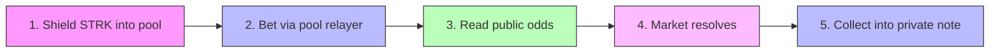

<p align="center">
  
</p>

<h1 align="center">Veilcast</h1>

<p align="center">
  <strong>Private prediction markets on Starknet. Visible odds, invisible bettors.</strong>
</p>

<p align="center">
  <a href="https://zkasuran.github.io/veilcast/"></a>
  <a href="https://github.com/zkasuran/veilcast/actions/workflows/pages.yml"></a>
  <a href="https://github.com/zkasuran/veilcast/actions/workflows/contracts.yml"></a>
  
  <a href="LICENSE"></a>
</p>

<p align="center">
  <a href="https://zkasuran.github.io/veilcast/">Live Demo</a> · <a href="docs/DEPLOY.md">Deploy Guide</a> · <a href="ARCHITECTURE.md">Architecture</a> · <a href="sdk/">SDK</a>
</p>

---

## For Judges — TL;DR

| | |
|---|---|
| **What** | A parimutuel prediction market where amounts are public (for honest odds) and identities are private (for honest flow) |
| **RFP match** | [RFP-07: Prediction markets with visible odds and invisible bettors](https://strk20.starknet.io/rfp/private-prediction-market) |
| **Privacy model** | Every bet is a STRK20 pool action — the on-chain sender is a rotating relayer, your address appears nowhere |
| **Novel design** | Bearer coupons (the position IS the key), dual resolution (Pragma oracle + juror committee), batch claims |
| **Stack** | Cairo 2.20 (35 tests) · Next.js 16 · TypeScript (105 tests) · STRK20 Wallet API · Pragma oracle |
| **SDK** | [`veilcast-sdk`](sdk/) — any TS app can read boards, place bets, and claim payouts through the pool |
| **Demo** | [zkasuran.github.io/veilcast](https://zkasuran.github.io/veilcast/) |

---

## What it is

Veilcast is a prediction market where the crowd's information stays public while the crowd stays
anonymous. Anyone can read the odds, the volume behind each outcome, and how a market is moving.
Nobody can see who placed a bet, tie two bets to one person, or tie a payout back to the bet that
earned it.

**Why this matters:** A prediction market is only worth reading when its price signal is honest,
and an honest signal needs open volume. It breaks when large players can be tracked — visible whales
cause herding and front-running, which drives off the flow that makes the price accurate. STRK20
lets Veilcast keep both halves: amounts stay public so the odds are real, identities stay private so
the flow stays honest.

---

## Privacy model

STRK20 gives identity privacy, not amount privacy. Veilcast is built around exactly that split.

| 🔓 Public | 🔒 Private |
|---|---|
| Each bet's amount and the outcome it backs | Who placed it — the market contract never sees an address |
| Per-outcome volume and the odds that come off it | The link between one person and their bets, across markets and inside one |
| Every market's question, resolver, and settlement | The link between a winning position and the wallet that collects it |
| A shield deposit: the depositor, the token, the amount | A payout, when it is collected into a private note |

> **We do not overclaim.** Shielding into the pool is a public, screened deposit. The privacy starts
> after that, once the balance is a private note. Amounts are public on purpose — a market with
> hidden sizes cannot produce accurate odds.

---

## How a bet works



1. **Shield** — Deposit STRK into the STRK20 pool. Public, screened on-chain. You now hold a private note.
2. **Bet** — One pool transaction atomically: withdraw your stake into the market contract and book the bet. The on-chain sender is the pool's rotating relayer — your address appears nowhere.
3. **Read the odds** — Per-outcome volume is public. The implied probability and payout multiple are the same for everyone.
4. **Resolve** — The market's named resolver settles it on-chain, in public.
5. **Collect** — Sign your coupon and the payout lands in a fresh private note inside the pool.

---

## The coupon system

Nothing on-chain ties a position to an account. When you bet, the browser generates a fresh Stark
keypair, sends the public half with the bet, and keeps the private half in localStorage.

**That is what makes the payout unlinkable:** the coupon key is fresh per bet, so two bets by the
same person share nothing on-chain, and the claim carries no address.

From the Positions tab you can:
- 🔐 **Back up** coupons (plain JSON or AES-GCM encrypted behind a passphrase)
- 📲 **Transfer** a position as a bearer ticket (`veilcast:` URI + QR code)
- 💰 **Batch collect** all winning positions in one pool transaction

---

## Resolution

Veilcast ships three resolution paths:

| Type | Contract | How it works |
|------|----------|-------------|
| **Owner** | `market.cairo` | Whoever opens a market is its resolver |
| **Oracle** | `pragma_resolver.cairo` | Bound to a Pragma spot pair and threshold — anyone can push the feed's median in to settle |
| **Jury** | `committee_resolver.cairo` | Named panel votes, first to quorum settles. Deadlock → 30-day public void |

Resolution is deliberately public. The terms of a market are not the thing that needs hiding. What
stays private is who was on each side.

---

## Tech stack

| Layer | Technology |
|-------|-----------|
| Smart contracts | Cairo 2.20 · Scarb · Starknet Foundry (35 tests) |
| Frontend | Next.js 16 · React 19 · CSS Modules · Dark/Light mode |
| State | Zustand 5 |
| Wallet | STRK20 Wallet API via get-starknet |
| Oracle | Pragma (mainnet feeds, 12 publishers) |
| SDK | TypeScript · starknet.js 10 · framework-free |
| Deploy | GitHub Pages (static export) · GitHub Actions CI/CD |
| Tests | Vitest (105 TS tests) · snForge (35 Cairo tests) |

---

## What runs today

| Component | Status |
|-----------|--------|
| Cairo market contract + 2 resolvers | ✅ Complete, 35 tests green |
| Frontend: board, bets, positions, charts, dark mode, toasts | ✅ Complete, 105 tests green |
| SDK (`veilcast-sdk`) with pinned test vectors | ✅ Complete |
| Live demo (GitHub Pages) | ✅ [zkasuran.github.io/veilcast](https://zkasuran.github.io/veilcast/) |
| CI/CD (contracts + pages) | ✅ Full pipeline |
| Contract deployment | 🔜 Next |
| Three mainnet pool transactions | 🔜 After deployment |

---

## Repo layout

```
cairo/
├── src/market.cairo                 the market: bets, volumes, resolution, claims
├── src/interface.cairo              ABI, calldata layout, error codes
├── src/pragma_resolver.cairo        oracle resolver: bind a price, settle from feed
├── src/committee_resolver.cairo     jury resolver: panel votes to settlement
├── src/pragma.cairo                 Pragma oracle interface
├── src/tests/                       contract tests + pool/feed mocks
└── scripts/deploy.sh               declare and deploy against a pool

src/
├── utils/veilcast.ts                coupons, claim signing, pool action lists, odds maths
├── utils/market.ts                  board reads, payout maths, public calls
├── utils/resolver.ts                price questions, feed reads, settlement
├── utils/committee.ts               juries: open, vote, read panel and tally
├── utils/vault.ts                   encrypted backups and bearer tickets
├── utils/portfolio.ts               per-position P&L, totals, CSV export
├── utils/discovery.ts               sections, search, status, sorting
├── utils/events.ts                  market history from on-chain events
└── app/components/client/market/    all UI: board, detail, bet, chart, positions

sdk/                                 veilcast-sdk: read and drive Veilcast from any TS app
docs/                                deployment guide, architecture
```

---

## Quick start

```bash
# Clone and install
git clone https://github.com/zkasuran/veilcast.git
cd veilcast
npm install

# Configure (optional — app works with defaults, just says "not deployed")
cp .env.example .env.local

# Run locally
npm run dev                    # http://localhost:3000

# Run tests
npm test                       # 105 TypeScript tests
cd cairo && snforge test       # 35 Cairo contract tests

# Type check and build
npm run typecheck
npm run build
```

Needs a privacy-enabled Starknet wallet (Ready) on Mainnet or Sepolia. The app never touches your
viewing key — proving and private state stay inside the wallet via the STRK20 Wallet API.

---

## Deploying

Full deployment guide: [docs/DEPLOY.md](docs/DEPLOY.md)

Quick version:

```bash
# Import your account
sncast account import --name veilcast --address <account> --private-key <key> \
    --type <oz|argent|braavos> --network sepolia

# Deploy (runs tests, builds, declares, prints deploy commands)
cd cairo
VEILCAST_POOL=<pool_address> ./scripts/deploy.sh sepolia
```

Or use the automated CI workflow: **Actions → Deploy contracts → Run workflow**.

---

## SDK

[`sdk/`](sdk/) is `veilcast-sdk` — a framework-free TypeScript package that reads and drives
Veilcast from any app or bot. It ships the contract ABIs, coupon and claim signing, pool action
lists, market reads, and payout maths. Depends only on starknet.js, works in Node and the browser.

```ts
import { loadBoard, newCoupon, betActions, formatStrk } from "veilcast-sdk";

const board = await loadBoard(provider, MARKET_ADDRESS);
const coupon = newCoupon(marketId, outcome, amount);
const actions = betActions(STRK_TOKEN, MARKET_ADDRESS, coupon);
await walletAccount.strk20InvokeTransaction(actions);
```

Full docs: [sdk/README.md](sdk/README.md)

---

## `strk20.json`

The sprint hub reads this file from the repo root:

```json
{
  "transactions": [],
  "contracts": [],
  "demo_video": "",
  "demo_url": "https://zkasuran.github.io/veilcast/"
}
```

Fields fill in as the build reaches mainnet. See [docs/DEPLOY.md](docs/DEPLOY.md) for the full flow.

---

## Architecture

See [ARCHITECTURE.md](ARCHITECTURE.md) for the detailed system design: data flow diagrams,
contract interactions, privacy boundaries, and the parimutuel math.

---

## Credits and disclosure

Bootstrapped from the [STRK20 starter kit](https://github.com/Akashneelesh/strk20-starter-kit) by
Akashneelesh, itself based on
[PhilippeR26/Starknet-WalletAccount](https://github.com/PhilippeR26/Starknet-WalletAccount). Built
on [STRK20](https://strk20.starknet.io) by StarkWare.

AI assistance (Claude) was used while building Veilcast. The design, the privacy model, and the
verification are the author's.

---

## License

[MIT](LICENSE)
