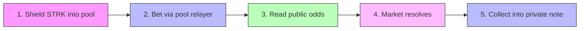

<p align="center">
  
</p>

<h1 align="center">Veilcast</h1>

<p align="center">
  <strong>Private prediction markets on Starknet. Visible odds, invisible bettors.</strong>
</p>

<p align="center">
  <a href="https://zkasuran.github.io/veilcast/"></a>
  <a href="https://github.com/zkasuran/veilcast/actions/workflows/pages.yml"></a>
  <a href="https://github.com/zkasuran/veilcast/actions/workflows/contracts.yml"></a>
  
  <a href="LICENSE"></a>
</p>

<p align="center">
  <a href="https://zkasuran.github.io/veilcast/">Live Demo</a> · <a href="docs/DEPLOY.md">Deploy Guide</a> · <a href="ARCHITECTURE.md">Architecture</a> · <a href="sdk/">SDK</a>
</p>

---

## For Judges — TL;DR

| | |
|---|---|
| **What** | A parimutuel prediction market where amounts are public (for honest odds) and identities are private (for honest flow) |
| **RFP match** | [RFP-07: Prediction markets with visible odds and invisible bettors](https://strk20.starknet.io/rfp/private-prediction-market) |
| **Privacy model** | Every bet is a STRK20 pool action — the on-chain sender is a rotating relayer, your address appears nowhere |
| **Novel design** | Bearer coupons (the position IS the key), dual resolution (Pragma oracle + juror committee), a leveraged FPMM book with a keeper-liquidated vault, plus on-chain mandates that let an agent trade for you without being able to take your money |
| **Agent-drivable** | The only STRK20 entry an autonomous agent can drive on mainnet with no browser. Ships skills for Claude Code, openclaw and Hermes |
| **Stack** | Cairo 2.20 (66 tests) · Next.js 16 · TypeScript (141 tests) · Node agent runtime (46 tests) · STRK20 Wallet API · Pragma oracle |
| **SDK** | [`veilcast-sdk`](sdk/) — any TS app can read boards, place bets, and claim payouts through the pool |
| **Demo** | [zkasuran.github.io/veilcast](https://zkasuran.github.io/veilcast/) |

---

## What it is

Veilcast is a prediction market where the crowd's information stays public while the crowd stays
anonymous. Anyone can read the odds, the volume behind each outcome, and how a market is moving.
Nobody can see who placed a bet, tie two bets to one person, or tie a payout back to the bet that
earned it.

**Why this matters:** A prediction market is only worth reading when its price signal is honest,
and an honest signal needs open volume. It breaks when large players can be tracked — visible whales
cause herding and front-running, which drives off the flow that makes the price accurate. STRK20
lets Veilcast keep both halves: amounts stay public so the odds are real, identities stay private so
the flow stays honest.

---

## Privacy model

STRK20 gives identity privacy, not amount privacy. Veilcast is built around exactly that split.

| 🔓 Public | 🔒 Private |
|---|---|
| Each bet's amount and the outcome it backs | Who placed it — the market contract never sees an address |
| Per-outcome volume and the odds that come off it | The link between one person and their bets, across markets and inside one |
| Every market's question, resolver, and settlement | The link between a winning position and the wallet that collects it |
| A shield deposit: the depositor, the token, the amount | A payout, when it is collected into a private note |

> **We do not overclaim.** Shielding into the pool is a public, screened deposit. The privacy starts
> after that, once the balance is a private note. Amounts are public on purpose — a market with
> hidden sizes cannot produce accurate odds.

---

## How a bet works



1. **Shield** — Deposit STRK into the STRK20 pool. Public, screened on-chain. You now hold a private note.
2. **Bet** — One pool transaction atomically: withdraw your stake into the market contract and book the bet. The on-chain sender is the pool's rotating relayer — your address appears nowhere.
3. **Read the odds** — Per-outcome volume is public. The implied probability and payout multiple are the same for everyone.
4. **Resolve** — The market's named resolver settles it on-chain, in public.
5. **Collect** — Sign your coupon and the payout lands in a fresh private note inside the pool.

---

## The coupon system

Nothing on-chain ties a position to an account. When you bet, the browser generates a fresh Stark
keypair, sends the public half with the bet, and keeps the private half in localStorage.

**That is what makes the payout unlinkable:** the coupon key is fresh per bet, so two bets by the
same person share nothing on-chain, and the claim carries no address.

From the Positions tab you can:
- 🔐 **Back up** coupons (plain JSON or AES-GCM encrypted behind a passphrase)
- 📲 **Transfer** a position as a bearer ticket (`veilcast:` URI + QR code)
- 💰 **Batch collect** all winning positions in one pool transaction

---

## Resolution

Veilcast ships three resolution paths:

| Type | Contract | How it works |
|------|----------|-------------|
| **Owner** | `market.cairo` | Whoever opens a market is its resolver |
| **Oracle** | `pragma_resolver.cairo` | Bound to a Pragma spot pair and threshold — anyone can push the feed's median in to settle |
| **Jury** | `committee_resolver.cairo` | Named panel votes, first to quorum settles. Deadlock → 30-day public void |

Resolution is deliberately public. The terms of a market are not the thing that needs hiding. What
stays private is who was on each side.

---

## Leverage

Alongside the parimutuel board, Veilcast runs a leveraged market: isolated-margin directional
positions on a binary book, opened and closed with the same privacy as a bet.

- **Provable FPMM.** Each market is a constant-product book over YES and NO shares, priced in exact
  integer arithmetic. No fixed-point `exp` or `ln`, so the math is auditable and every rounding step
  favors the pool. The quote a trader sees in TypeScript is the number the contract books, pinned
  felt for felt against the Cairo tests.
- **Isolated margin, up to 5x.** A trader posts margin, the vault lends the rest up to the notional,
  and the position is marked and settled against the live AMM price. Margin is the most a trader can
  lose.
- **Keeper-liquidated, insurance-backed.** Anyone can liquidate a position once its equity falls to
  8% of notional, repaying the vault before the loan goes bad. An insurance fund, seeded by a 0.30%
  open fee, absorbs any residual gap.
- **Solvent by construction.** Reserves are backed one for one by STRK held in the contract (the
  complete-set model), so the contract itself can never be drained. Leverage risk lives in the
  vault, bounded by liquidation and insurance. The balance invariant `balance >= vault_free +
  total_backing + insurance` is asserted on every path and fuzzed across random open, close and
  liquidate sequences.
- **Private open and close.** Both route through the STRK20 pool exactly like a bet, keyed by a
  bearer coupon whose signature names the payout target so a relayer can never redirect it.
  Liquidity and liquidation are public, because they are the market's plumbing, not a trade.

Trade it from the **Leverage** tab: pick a side, post margin, choose leverage against a live quote,
then watch the position marked to the book and close to your wallet.

---

## Agents

Veilcast is drivable by an autonomous agent on mainnet, with no browser and no human in the loop.

Most STRK20 dapps cannot be, because a pool action carries a STARK proof and the mainnet proving
service URL was never published, so the field settled on a browser wallet with the prover baked in.
The proving and discovery services are reachable over OHTTP with no API key, so a process can prove
and submit on its own. `agent/` encodes that whole flow, along with every rule it took a failure to
learn. See [docs/INTEGRATION.md](docs/INTEGRATION.md).

```bash
npx veilcast-agent init      # detects your host, writes its skill files, generates a key, probes mainnet
veilcast-agent status        # what you are pointed at and what you may do
veilcast-agent markets       # the live mainnet board: questions, odds and what a stake pays
veilcast-agent flow --market 0   # that market's bet history, amounts and bearer keys, never addresses
```

Those two read the deployed mainnet market, so they work right now with no keys and no setup. The board
is decoded straight from raw felts, which means the runtime needs no ABI file and cannot drift from the
deployment. `markets` also quotes what a given stake would pay, counting itself into the pot the way the
contract does, so an agent can refuse a bet whose multiple is below 1.0.

It ships skills for **Claude Code, openclaw and Hermes**, plus a host-neutral `AGENTS.md` and a
machine-readable capability manifest, all generated from one source of truth so they cannot disagree.
Every command prints a single JSON object, every money command is a dry run unless you pass
`--confirm` and the exit codes are stable enough to branch on.

### Delegation without custody

The interesting part is what an agent is allowed to do. A **mandate** is a bounded authority the
position owner attaches at open: an agent key, a stop and take price band and a payout address. All
three are stored on-chain and checked on every agent close.

So an agent can fire your stop while you sleep. It cannot redirect the payout, cannot act outside the
band, cannot widen its own authority, cannot touch a self-managed position and cannot pass its
signature off as yours. None of that is policy in the CLI. It is
[cairo/src/leveraged_market.cairo](cairo/src/leveraged_market.cairo), which is why an agent key is
safe to hand out: the worst a stolen one buys is firing a stop the owner already asked for, at a price
the market actually reached, paying the owner's own address.

That claim is fuzzed rather than asserted. See [docs/SECURITY.md](docs/SECURITY.md) for the threat
model and the test that proves each line of it and [docs/OPERATIONS.md](docs/OPERATIONS.md) for
running a keeper or a watcher with measured costs.

---

## Tech stack

| Layer | Technology |
|-------|-----------|
| Smart contracts | Cairo 2.20 · Scarb · Starknet Foundry (66 tests) |
| Frontend | Next.js 16 · React 19 · CSS Modules · Dark/Light mode |
| State | Zustand 5 |
| Wallet | STRK20 Wallet API via get-starknet |
| Oracle | Pragma (mainnet feeds, 12 publishers) |
| SDK | TypeScript · starknet.js 10 · framework-free |
| Deploy | GitHub Pages (static export) · GitHub Actions CI/CD |
| Tests | Vitest (141 TS) · snForge (66 Cairo) · node:test (46 agent) |

---

## What runs today

| Component | Status |
|-----------|--------|
| Cairo market contract + 2 resolvers | ✅ Complete, live on mainnet |
| Leveraged market (FPMM, vault, keeper liquidation) | ✅ Complete in code and UI, mainnet deploy pending |
| On-chain mandates (bounded agent delegation) | ✅ Complete, 66 Cairo tests including adversarial fuzz |
| `veilcast-agent` runtime + skills for 3 hosts | ✅ Complete, 46 tests, verified live against mainnet |
| Frontend: board, bets, positions, leverage, charts, dark mode | ✅ Complete |
| SDK (`veilcast-sdk`) with pinned test vectors | ✅ Complete, market and leverage |
| Contracts on Starknet mainnet | ✅ Market + Pragma + Committee deployed and verified |
| Mainnet pool transactions | ✅ Three deposits and a private bet, in `strk20.json` |
| Live demo (GitHub Pages) | ✅ [zkasuran.github.io/veilcast](https://zkasuran.github.io/veilcast/) |
| CI/CD (contracts + pages) | ✅ Full pipeline |
| Tests | ✅ 52 Cairo (snForge) and 127 TypeScript (Vitest) green |

---

## Repo layout

```
cairo/
├── src/market.cairo                 the market: bets, volumes, resolution, claims
├── src/interface.cairo              ABI, calldata layout, error codes
├── src/leveraged_market.cairo       leveraged FPMM market: vault, margin, keeper liquidation
├── src/leverage_interface.cairo     leverage ABI, calldata layout, error codes
├── src/pricing.cairo                constant-product FPMM: buy, sell, price, all integer
├── src/pragma_resolver.cairo        oracle resolver: bind a price, settle from feed
├── src/committee_resolver.cairo     jury resolver: panel votes to settlement
├── src/pragma.cairo                 Pragma oracle interface
├── src/tests/                       contract tests + pool/feed mocks
└── scripts/deploy.sh               declare and deploy against a pool

src/
├── utils/veilcast.ts                coupons, claim signing, pool action lists, odds maths
├── utils/market.ts                  board reads, payout maths, public calls
├── utils/leverage.ts                leverage pricing mirror, quotes, coupons, actions, reads
├── utils/resolver.ts                price questions, feed reads, settlement
├── utils/committee.ts               juries: open, vote, read panel and tally
├── utils/vault.ts                   encrypted backups and bearer tickets
├── utils/portfolio.ts               per-position P&L, totals, CSV export
├── utils/discovery.ts               sections, search, status, sorting
├── utils/events.ts                  market history from on-chain events
├── app/components/client/market/    board, detail, bet, chart, positions
└── app/components/client/leverage/  the Leverage tab: trade, mandates, positions, vault

agent/                               veilcast-agent: drive Veilcast headlessly from an autonomous agent
├── cli.mjs                          18 verbs, one JSON object out, dry run by default
├── src/pool.mjs                     the headless mainnet pool flow, every rule encoded once
├── src/install.mjs                  host detection and the skill packs, from one source of truth
└── skills/capabilities.json         the machine-readable capability manifest

sdk/                                 veilcast-sdk: read and drive Veilcast from any TS app
docs/                                deployment guide, architecture
```

---

## Quick start

```bash
# Clone and install
git clone https://github.com/zkasuran/veilcast.git
cd veilcast
npm install

# Configure (optional — app works with defaults, just says "not deployed")
cp .env.example .env.local

# Run locally
npm run dev                    # http://localhost:3000

# Run tests
npm test                       # 141 TypeScript tests
cd cairo && snforge test       # 66 Cairo contract tests
cd agent && npm test           # 46 agent runtime tests

# Type check and build
npm run typecheck
npm run build
```

Needs a privacy-enabled Starknet wallet (Ready) on Mainnet or Sepolia. The app never touches your
viewing key — proving and private state stay inside the wallet via the STRK20 Wallet API.

---

## Deploying

Full deployment guide: [docs/DEPLOY.md](docs/DEPLOY.md)

Quick version:

```bash
# Import your account
sncast account import --name veilcast --address <account> --private-key <key> \
    --type <oz|argent|braavos> --network sepolia

# Deploy (runs tests, builds, declares, prints deploy commands)
cd cairo
VEILCAST_POOL=<pool_address> ./scripts/deploy.sh sepolia
```

Or use the automated CI workflow: **Actions → Deploy contracts → Run workflow**.

---

## SDK

[`sdk/`](sdk/) is `veilcast-sdk` — a framework-free TypeScript package that reads and drives
Veilcast from any app or bot. It ships the contract ABIs, coupon and claim signing, pool action
lists, market reads, and payout maths. Depends only on starknet.js, works in Node and the browser.

```ts
import { loadBoard, newCoupon, betActions, formatStrk } from "veilcast-sdk";

const board = await loadBoard(provider, MARKET_ADDRESS);
const coupon = newCoupon(marketId, outcome, amount);
const actions = betActions(STRK_TOKEN, MARKET_ADDRESS, coupon);
await walletAccount.strk20InvokeTransaction(actions);
```

The same three layers cover the leveraged market: `quoteOpen` and `markPosition` mirror the FPMM
on-chain, `openActions` and `closeToWalletActions` build the private pool transactions, while
`addLiquidityCall` and friends drive the vault.

Full docs: [sdk/README.md](sdk/README.md)

---

## `strk20.json`

The sprint hub reads this file from the repo root. It carries the live mainnet deployment: the
market and both resolvers, plus four pool transactions (three deposits and a private bet).

```json
{
  "transactions": [
    "0x747e97fa539bb1b566d1bcb5529c4c1089a46b4fca20aac8ba685ffdbdfde7",
    "0x95ce11a4cb0ac58bd76a7e94b07b47650bdcf9769907c8c628c773ab00f78",
    "0x21234b944ac0b7c8d58a6aff7d9a0878941ff0881de6a42a39cfecfbfd4f2e6",
    "0x6fcd0c39c2407a50f42297fbcef65b9b3f278f86707f7c6bf4b5d1e324cc095"
  ],
  "contracts": [
    { "name": "VeilcastMarket", "address": "0x036be78d…c36c6b8", "network": "mainnet" },
    { "name": "PragmaResolver", "address": "0x0665a23c…80a259b", "network": "mainnet" },
    { "name": "CommitteeResolver", "address": "0x00b0dec2…4e6cd7", "network": "mainnet" }
  ],
  "demo_video": "",
  "demo_url": "https://zkasuran.github.io/veilcast/"
}
```

The leveraged market's address joins `contracts` once it is deployed. See
[docs/DEPLOY.md](docs/DEPLOY.md) for the full flow.

---

## Architecture

See [ARCHITECTURE.md](ARCHITECTURE.md) for the detailed system design: data flow diagrams,
contract interactions, privacy boundaries, and the parimutuel math.

---

## Credits and disclosure

Bootstrapped from the [STRK20 starter kit](https://github.com/Akashneelesh/strk20-starter-kit) by
Akashneelesh, itself based on
[PhilippeR26/Starknet-WalletAccount](https://github.com/PhilippeR26/Starknet-WalletAccount). Built
on [STRK20](https://strk20.starknet.io) by StarkWare.

AI assistance (Claude) was used while building Veilcast. The design, the privacy model, and the
verification are the author's.

---

## License

[MIT](LICENSE)
